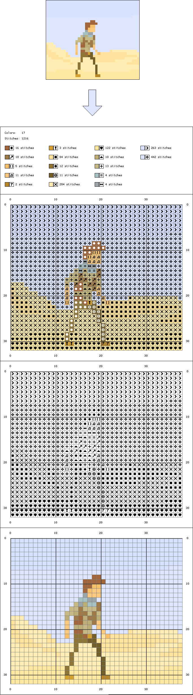

# Pixie Stitch

A [cross-stitch](https://en.wikipedia.org/wiki/Cross-stitch) (and fusible-beads) pattern generator for Windows that is specialized for pixel art
and ease of use via drag-and-dropping of images. 

# Usage

The easiest way to use Pixie Stitch is to download the latest release from the 
[release page](https://github.com/kerskuchen/pixie_stitch/releases) and extract it to a directory 
of our choice. 

We then can start drag-and-dropping our pixel-art images onto the `pixie_stitch.exe`.
Doing that will create a new folder which contains our cross-stitch-patterns and is named like 
our image.



Additional example output can be found in the `examples` directory.

# Limitations

As of now Pixie Stitch supports `.png` and `.gif` images with up to 17 colors. The number of colors
can be increased by adding additional black-and-white `16x16`-pixels-sized symbol images in the 
`resources` folder where our executable is located.

# Similar software

Pixie stitch has a very narrow use-case and is specialized for small pixel art with
few colors and optional transparency.

For a more general use-case there are lots of other software for cross-stitch pattern generation 
like:

* https://www.pixel-stitch.net/
* https://www.stitchfiddle.com/en
* http://www.myphotostitch.com/Make_Pattern/Make_Pattern.html
* https://www.pic2pat.com/index.en.php

These have lot of extra feature like size- / color palette interpolation and yarn length 
calculations. They also support way more image formats, output `.pdf` files and can run directly 
in the browser.

# Building it

Assuming we have [Git](https://git-scm.com/) installed first we need to clone and initialize this 
repository via:

```
git clone https://github.com/kerskuchen/pixie_stitch.git
cd pixie_stitch
git submodule update --init --remote
```

Assuming we have [Rust](https://www.rust-lang.org/) installed and can run `cargo` commands we can
build a release version by just running `windows_build_shipping.bat`. This creates a new folder 
named `windows_shipping` which contains the final executable ready to run with all needed
resources.

If we have the [Resource Hacker](http://angusj.com/resourcehacker/) tool in our `%PATH` the 
`windows_build_shipping.bat` script will also set a launcher icon and version information for our 
executable.

# Development

We can build a debug version by running the usual `cargo build` command. The 
[Rust](https://www.rust-lang.org/) website has good information about how to start development 
with Rust.

For development it is a good idea to check out the `cottontail` submodule on the master branch via

```
cd cottontail
git checkout master
```

That will make sure that we don't accidentally commit something to `cottontail` in the 
detached `HEAD` state.

To update `cottontail` to its latest version on master we can run the `git_update_cottontail.bat` 
script.
